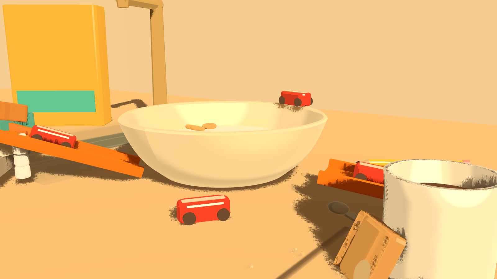
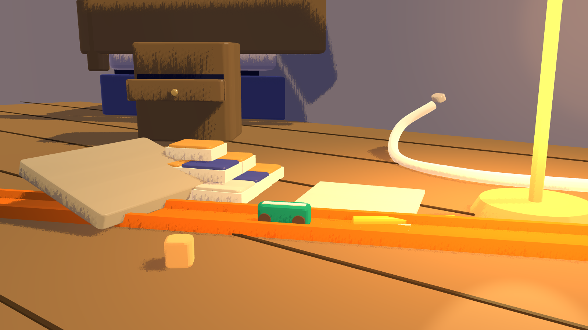
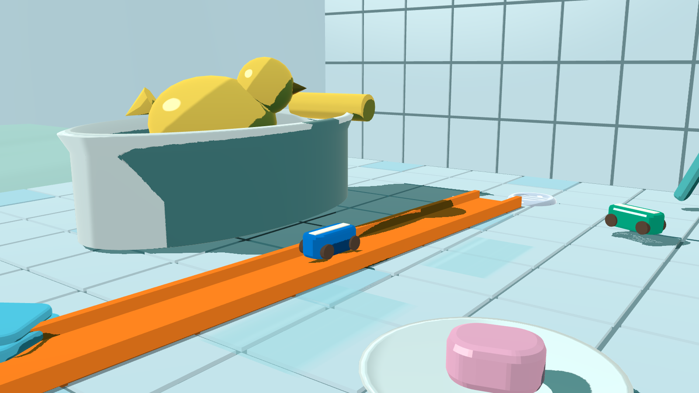
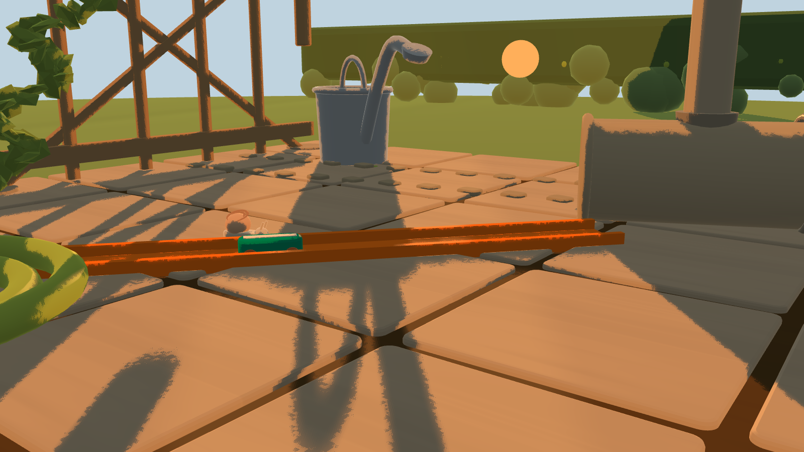
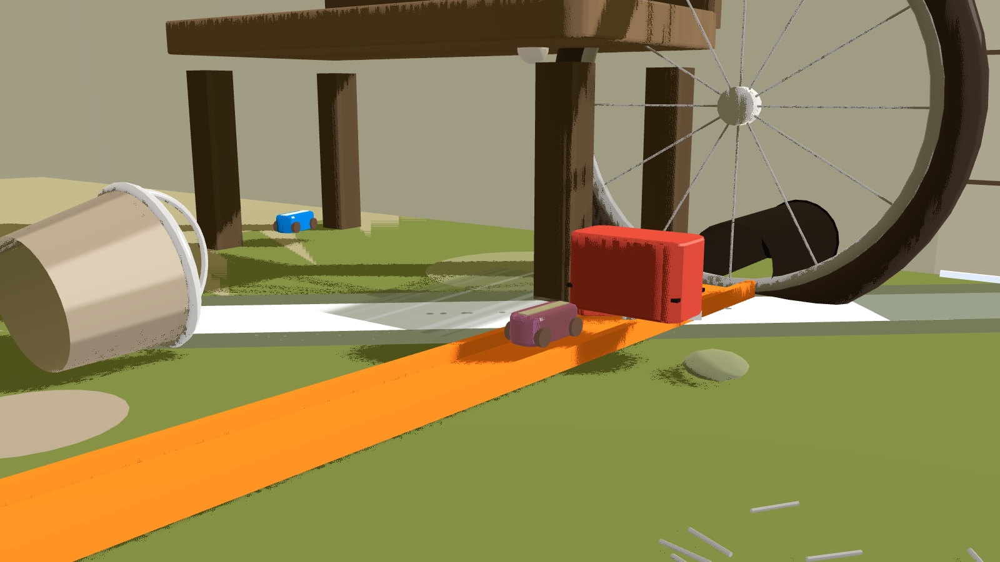
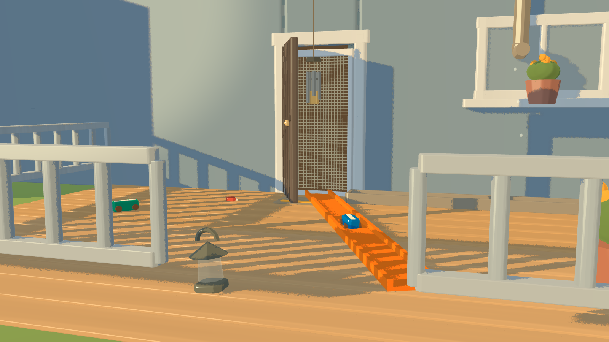
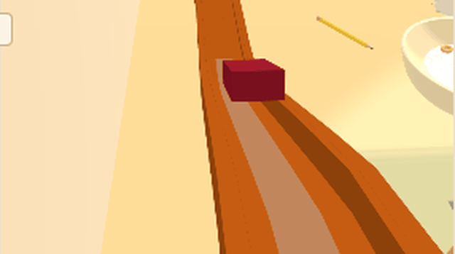

# Gravity Works

Gravity Works is a tilt-shift marble-run sandbox: a physics toy car races a
line of toy track you snap together on a 1:64 scale model of a house —
kitchen, bedroom, bathroom, garden, garage, and the porch finale — thirty
rungs on one flat ladder. Every run is deterministic fixed-step physics
(120 Hz), so a finish is shareable as a replay hash that re-simulates
byte-identically, and every par line on the ladder replays verified in CI.
The look is a toon-shaded die-cast miniature: ramp-quantised materials,
banded shadows, and a 35 mm depth-of-field law at every camera.

**Play it live: <https://gusellerm.github.io/gravity-works/>**

## Run it locally

    npm install
    npm run dev        # vite dev server, http://localhost:5173

Or the production shape:

    npm run build
    npm run preview    # serves dist/ (preview defaults to :4173; --port <n> to move)

Any preview port you start should be **4460+** — parallel worktrees share a
box and lower ports belong to other agents' suites.

## Tests

    npm test                    # unit (vitest) — 761 tests
    E2E_PORT=4460 npm run test:e2e   # Playwright e2e — 189 passed / 1 skip
    npm run test:e2e:filmstrip   # mid-run readability gate (owns port 4210, own config)
    npm run replay:all           # every rung's par build replayed twice — 30/30 verified
    npm run perf:table           # per-set 60 fps harness (tools/perf-table.mjs)
    npm run render -- --scene kitchen-set --shot hero --out out.png   # deterministic stills

## Controls (exactly the in-game hint line, `src/ui/builder.ts`)

> Aim: hover the world or press ] for the other spot · Place: click the world
> or Enter · Flip: R · Launch: L · Look: right-drag · Home: press Esc twice

Keyboard-only is a first-class path: Tab walks the real focus chain, Enter
holds and places, `L` launches, `]` walks aim ties (no mouse required —
proven end-to-end in `tests/e2e/a11y.spec.ts`). On touch: tap aims and
places, two-finger drag orbits, the browser pinch stays a magnifier.

## What's proven

- **Determinism anchors** — node↔browser replay hard-matches at `099403c7`
  (page verdict `verified`); the feel-table variants ride `cee96961` /
  `90d4cd69`; the campaign par hashes `0b4dbab2` (kitchen02) and `a1a50d05`
  (kitchen03) are re-derived, not assumed (`docs/vault/Home.md`, `Modules/replay`).
- **replay:all — 30/30** — `npm run replay:all` replays every campaign
  rung's par build twice in order; both runs finish with equal hashes and
  respect `pars.json` par times (30 rungs, all verified).
- **60 fps on every set** — all six sets measured on the reference machine
  with hardware GL (Apple M5 Pro, ANGLE Metal) at their busiest hero rung,
  post stack ON: median **16.70 ms** everywhere, 0–1 dropped frames,
  2.6–4.5 ms unpaced frame cost (`docs/vault/Reference/Performance 2026-10-08.md`).
- **A11y audit** — contrast table computed in CI (`scripts/a11y-contrast.mjs`),
  Tab-chain and keyboard-end-to-end specs, touch gates at 390/820 px,
  reduced-motion sweep ledger (`docs/vault/Reference/Accessibility audit 2026-10-08.md`).

## Renders

Deterministic stills at 1600×900 through each set's ratified hero camera
(`tools/render.mjs`, `docs/vault/Reference/Canonical Cameras.md`):

| Kitchen | Bedroom | Bathroom |
|---|---|---|
|  |  |  |
| **Garden** | **Garage** | **Porch** |
|  |  |  |

## A run

A real L02 par run on the built page, sampled with the filmstrip tooling
(warm start, wall-clock canvas samples, `tools/readme-clip.mjs`) and encoded
to a verified-animating GIF (0.35 MB, 0.75 s):

## Layout

- `src/` — game (physics, world, track kit, camera, render, ui, replay, sound)
- `tools/` — deterministic render harness, replay-all gate, perf table, clip tool
- `docs/vault/` — design bible, decisions, reviews, per-module notes
- `tests/` — unit (vitest) + e2e (Playwright) + visual
