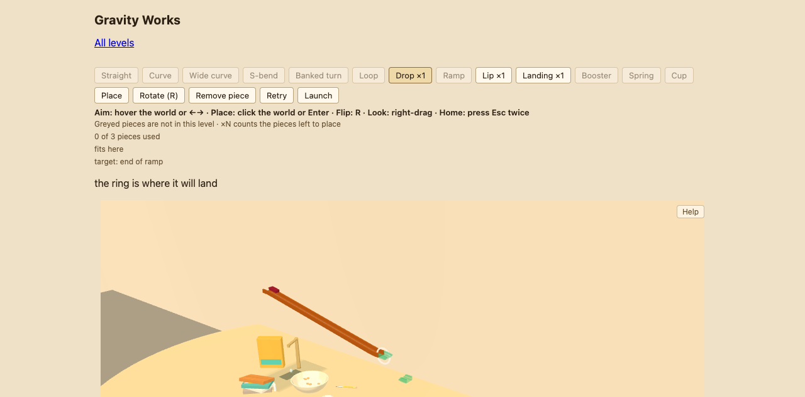
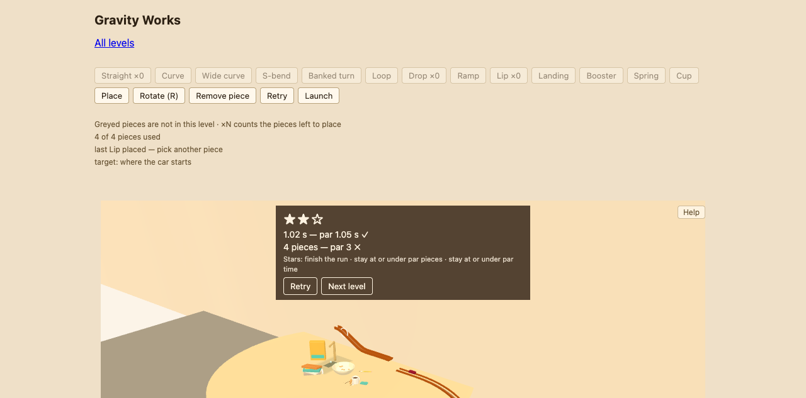
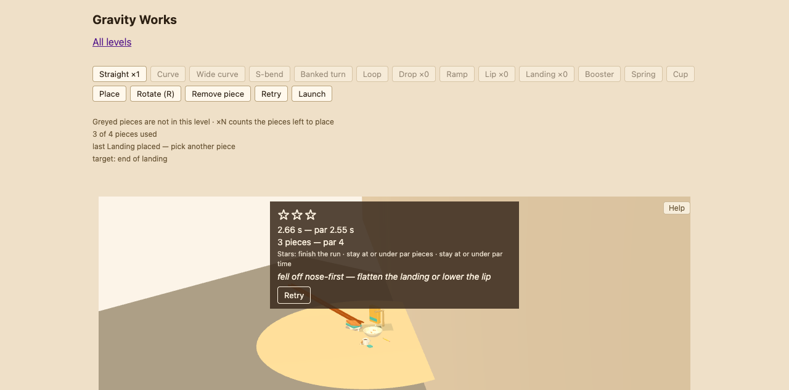

# 2026-01-18 — Playtest Y round6 (fresh-eyes, kitchen ladder)

Fresh stranger playtest of the live site via browser automation, 1280x768, no instructions, sessionMode fresh.

## 1. How far (in order)
- Book Drop (kitchen01): placed Drop+Lip+Landing on the ring path, one try, launch 1/1, 2.37 s (par 2.25 ✗), 3 pieces ✓ — 1 star.
- Two Ways: Straight, Straight, Drop, Lip, all first-try fits — 2 stars (1.02 s ✓, 4 vs par 3 ✗).
- The Bowl: Straight ×2, Drop, Lip, Landing, all first-try — 2 stars.
- The Tap: Straight blocked by faucet (red ghost); Drop+Lip+Landing run FAILED "fell off nose-first"; retry added Straight on landing — 2 stars (2.59 s ✗, 4 ✓).
- WALL at Sunday Run: 4 levels ≈ 40 min of stranger patience. Bedroom/Bathroom/Garden/Garage never reached.

## 2. Hover "fits here" → click
Level 1, holding Drop, cursor (560,650): status "fits here", ghost snapped to (605,688). CDP mouse down/up at (560,650) and at the ghost (605,688): NOTHING landed (still "0 of 3"). `Enter` placed instantly. Every level: clicks inert, Enter always placed at the ring. Possibly an automation-input artifact, but the asymmetry is total. Ghosts far from cursor: L2 hover (600,700) → ghost (565,590); L4 hover (680,700) said "fits here" with no ghost visible anywhere on screen (piece landed at off-screen viewport edge, y>740).

## 3. Camera
Right-drag orbits reliably (big rotation, kitchen becomes diamond). Esc-Esc returns home cleanly, once.

## 4. Advice about an unplaced piece
"target: end of curve" (Two Ways, goal line) — Curve is greyed; none exists in the level. Also "target: where the car starts" (post-run, Bowl) — reads like a piece name.

## 5. Best moment

## 6. Words I couldn't interpret
"where the car starts" as a target; "fell off nose-first" (whose nose?); "flatten" a Landing (how? R?); greyed "×N" vs no-count.

## 7. Failures with invisible cause
Level 3 "done" state showed no toast — only stars; whether the car reached the cup was unconfirmable (camera dove into the toaster mid-run).

## 8. Friend moment

Caption: "the game tells me exactly how to fix it, which somehow hurts more"
